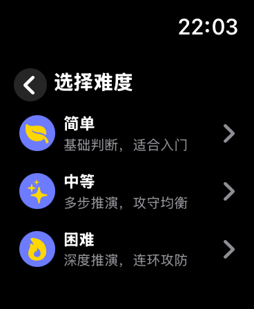
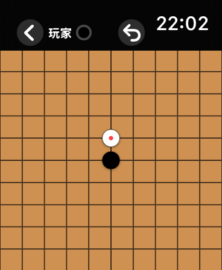
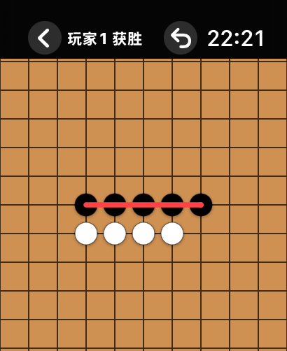

# GomokuWatch · 手表五子棋

**可以在 Apple Watch 上独立运行的离线五子棋，适合要交手机、又想用手表摸鱼下两局的场景。**

安装完成后，游戏和 AI 都在手表本地运行，无需手机在旁，也无需联网。支持同一块手表上的双人轮流对弈和三个难度的 AI 对战。

当前版本：**0.1.0 预览版**，以 MIT 许可证公开源码。

还没给苹果交开发者计划的年费，所以暂时没有上架 App Store，也没有提供 TestFlight 测试版。想玩的话，需要在 Mac 上通过 Xcode 自行编译、签名并安装到 Apple Watch；具体步骤见下方「运行」。

## 界面预览

以下为 44 mm Apple Watch 模拟器实测截图。

<p>
  
  
  
</p>

## 玩法

- 自由五子棋：五子或以上连线获胜，无三三、四四或长连禁手。
- 双人模式在同一块手表上轮流操作；AI 模式可选择难度和黑白棋。
- 点击交叉点预览，再点同一位置确认落子；最后一手显示红点，胜利连线显示红线。
- 初始显示 11×11，靠近边缘落子后逐步扩充到最多 101×101。
- 表冠每档增加 0.5×，倍率相对于当前棋盘全景；11×11 为 1–2×，21×21 为 1–4×，31×31 为 1–6×。最高档格距始终是初始格距的两倍。
- 放大后拖动棋盘，转动表冠缩小可返回全景。
- 支持悔棋；离开前台或息屏时暂停，返回后选择继续或放弃。
- 胜局保留在屏幕上供查看，回到首页后清空棋局。

## 开发环境

- macOS 与 Xcode；当前验证环境为 Xcode 26.6、watchOS 26.5 模拟器。
- 工程部署目标为 watchOS 10.0；尚未逐个验证所有支持的系统版本。
- 已提交可直接打开的 `GomokuWatch.xcodeproj`，一般运行无需 XcodeGen。
- 修改工程结构时使用 [XcodeGen](https://github.com/yonaskolb/XcodeGen)，以 `project.yml` 为配置源，并一并提交生成的工程。

## 运行

1. 用 Xcode 打开 `GomokuWatch.xcodeproj`。
2. 选择 `GomokuWatch` scheme 和 Apple Watch 模拟器，点击 Run。
3. 如缺少模拟器，在 Xcode Settings → Components 中安装 watchOS runtime。

真机运行需在 Xcode 登录自己的 Apple 账号，在 Signing & Capabilities 中选择自己的 Team，并设置可用的 Bundle Identifier。连接、配对并信任设备，按 Xcode 提示启用开发者模式。个人签名配置请勿提交。

## 构建和测试

```sh
# 可选：修改 project.yml 后重新生成工程
xcodegen generate

# 无需签名的 Release 模拟器构建
xcodebuild build -project GomokuWatch.xcodeproj -scheme GomokuWatch \
  -configuration Release -destination 'generic/platform=watchOS Simulator' \
  CODE_SIGNING_ALLOWED=NO

# 自动选择可用 watchOS 模拟器，运行全部单元测试
./scripts/test.sh

# 指定模拟器
WATCH_SIMULATOR_ID=<模拟器UUID> ./scripts/test.sh

# UI 测试单独运行
xcodebuild test -project GomokuWatch.xcodeproj -scheme GomokuWatch \
  -destination 'platform=watchOS Simulator,id=<模拟器UUID>' \
  -parallel-testing-enabled NO -only-testing:GomokuWatchUITests CODE_SIGNING_ALLOWED=NO
```

GitHub Actions 配置执行模拟器构建和单元测试。UI 测试包含表冠、暂停、落子、扩充、拖动与布局场景，需要可运行的模拟器。

## 数据和限制

游戏不要求账号，当前应用代码没有网络请求或分析 SDK。本地持久保存战胜 AI 的次数；不提供跨设备同步或退出进程后的棋局恢复。

## 项目结构

- `GomokuWatch/Models`：规则、AI、游戏状态和棋盘几何。
- `GomokuWatch/Views`：SwiftUI 界面与 Canvas 棋盘。
- `GomokuWatchTests`、`GomokuWatchUITests`：单元测试和界面测试。
- `docs/RELEASE_CHECKLIST.md`：首发检查与待确认事项。

## 许可证

采用 [MIT License](LICENSE)，版权署名为 shichuang。
